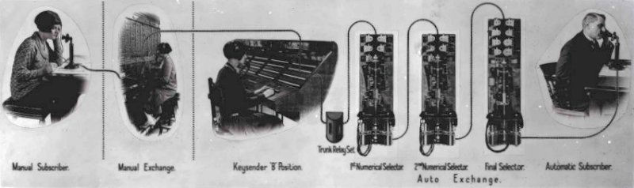
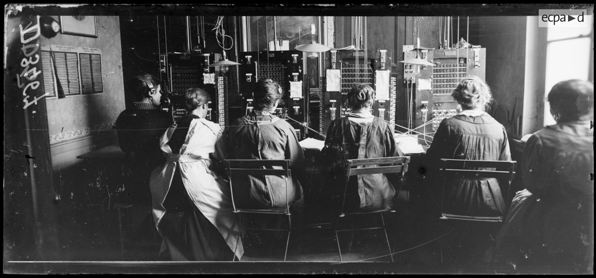
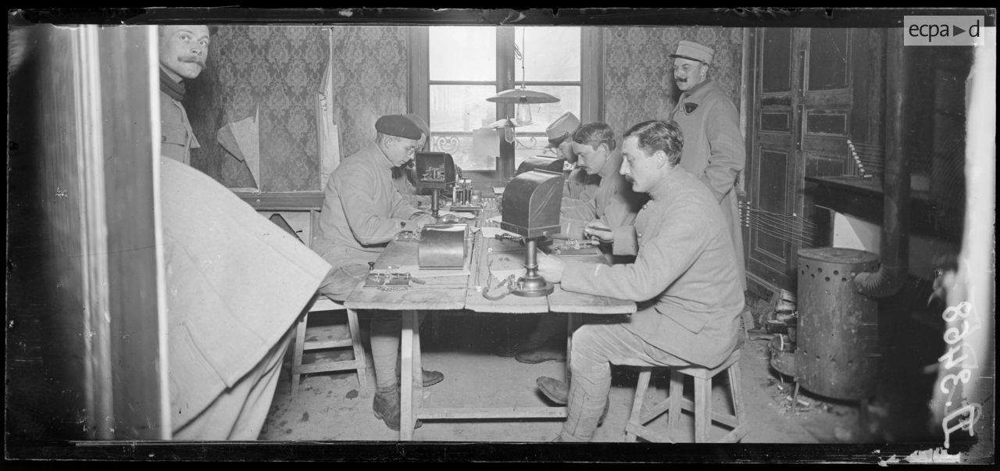
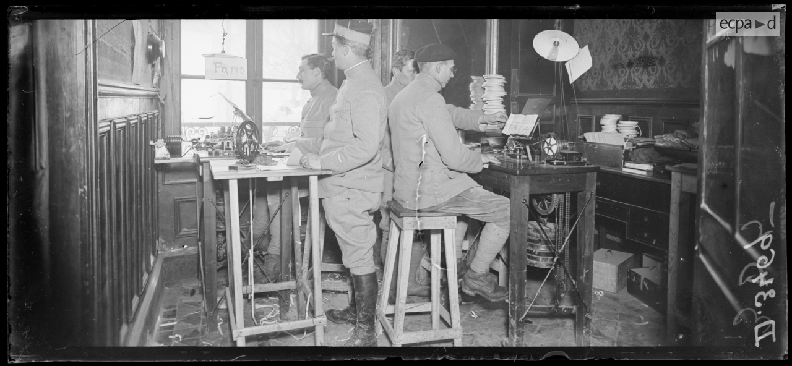
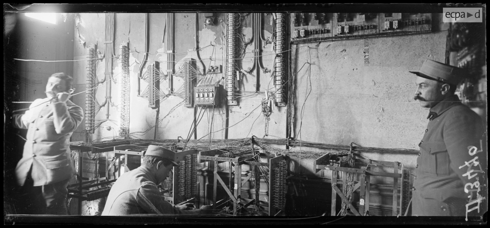
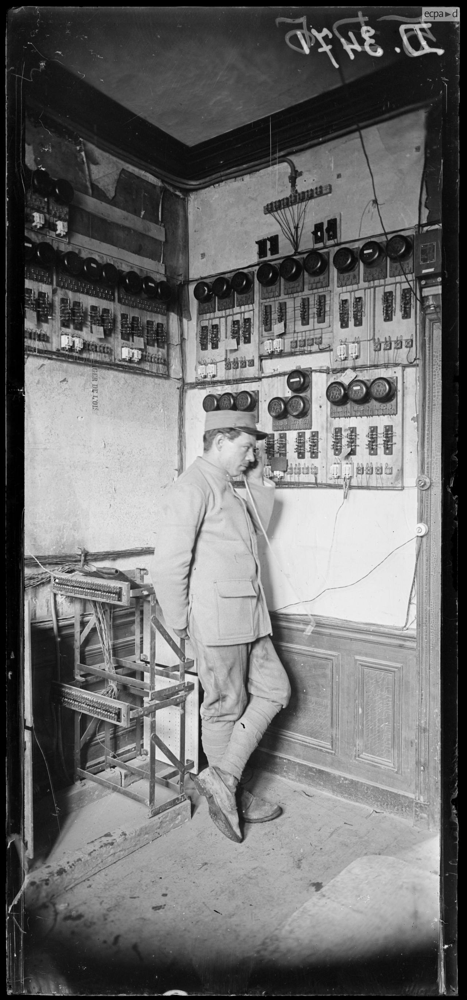
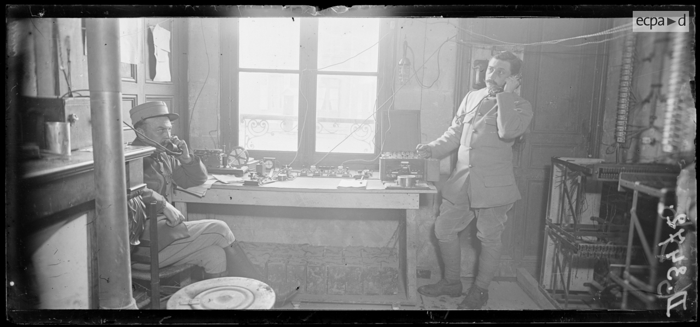
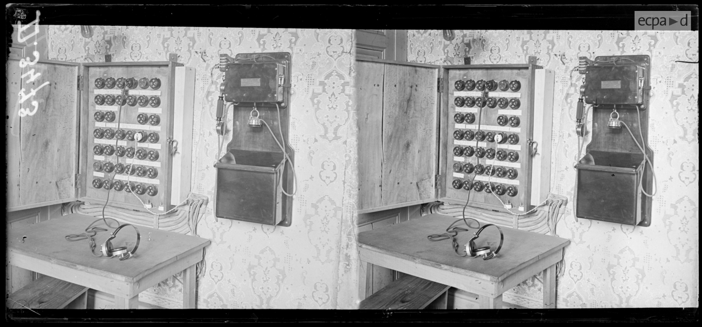
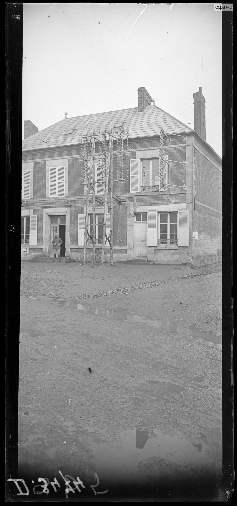

# /**
# * Tiêu đề : "Những tiếng chuông của Tổ quốc thân yêu."
# *
# * @copyright Copyright (c) 2026, Hoàng Hải <leduchoanghai@yahoo.com>
# * @license   MIT, http://www.opensource.org/licenses/mit-license.php
# */

Tổng đài cộng điện hay The Central Battery (C.B.) system là tổng đài điện thoại thủ công, thuộc loại pin trung tâm (CB) tương tự như hình bên dưới.

Bảng điều khiển trung tâm pin BE CB 30/50 năm 1907

Có nhiều biến thể của hệ thống CB nhưng trên thực tế, tất cả đều hoạt động theo cách tương tự.

Hệ thống Pin Trung Tâm (CB) được định nghĩa là hệ thống trong đó toàn bộ năng lượng cần thiết cho việc truyền tải và báo hiệu được lấy từ tổng đài. Không sử dụng pin hoặc máy phát điện cầm tay ở đầu dây điện thoại và các cuộc gọi được báo hiệu tự động bằng đèn trên bảng điều khiển tổng đài. Đèn báo hiệu cho người vận hành biết khi nào cuộc gọi đã kết thúc.

Một tổng đài CB công cộng có thể bao gồm nhiều tổng đài, trong khi một hệ thống riêng, được gọi là PMBX (chỉ xử lý cuộc gọi tại cơ sở của khách hàng), thường chỉ bao gồm một hoặc hai tổng đài.

Trên hệ thống CB, người gọi chỉ cần nhấc ống nghe và chờ tổng đài viên trả lời. Một đèn trên tổng đài cục bộ sẽ sáng lên và tổng đài viên cắm dây vào mạch đó. Khi có người trả lời, người gọi cho tổng đài viên biết số điện thoại hoặc dịch vụ mình muốn gọi. Nếu là cuộc gọi nội hạt, tổng đài viên sẽ cắm dây vào số điện thoại được yêu cầu và đổ chuông. Khi có người trả lời, tổng đài viên sẽ rời khỏi đường dây, nhưng sẽ gắn một phiếu ghi thông tin cuộc gọi và thời gian gọi vào phiếu. Khi người gọi cúp máy, đèn giám sát mạch dây của tổng đài viên sẽ sáng lên báo hiệu đã kết thúc cuộc gọi, và tổng đài viên sẽ rút dây và ghi thêm thời gian gọi vào phiếu. Tất cả các phiếu được nhân viên quản lý tổng đài thu thập và phí cuộc gọi được tính toán thành hóa đơn cuối cùng.

Hệ thống này đạt được mức tiết kiệm đáng kể và chất lượng truyền tải tốt nhờ nguồn điện trung tâm. Nhu cầu về nguồn điện cục bộ và máy phát điện cầm tay chỉ còn được giữ lại cho các điện thoại thử nghiệm, các tổng đài PMBX lớn, một số kế hoạch mở rộng và một số mạch riêng, mặc dù ngày nay những thiết bị này thường không còn được sử dụng.

Vào thời kỳ đầu, tất cả các điện thoại đều có một máy phát gắn liền và có nhiều loại, nhiều nhãn hiệu khác nhau. Vấn đề là chúng thường to, cồng kềnh và thường cần điều chỉnh để hoạt động được. Sau đó, máy phát hạt carbon được phát minh, nhỏ gọn và nhẹ hơn. Điều này có nghĩa là một thiết bị cầm tay có thể được sử dụng cho cả chức năng phát và thu - và từ đó, điện thoại cầm tay ra đời.

Nhưng vì máy phát tín hiệu dùng hạt carbon dễ bị ảnh hưởng bởi sự đóng gói, nhiễu đường dây và tiếng ồn, nên chúng phù hợp hơn với điện thoại dùng pin cục bộ hoặc được gắn cố định vào điện thoại. Bắc Mỹ, trong những ngày đầu, không sử dụng điện thoại cầm tay, do đó việc chuyển sang sử dụng CB (Carbon Granule) được đẩy nhanh ở các thị trấn và thành phố. Tổng đài CB đầu tiên được lắp đặt vào năm 1880.

Khoảng năm 1930, Bưu điện Anh (GPO) đã tiến hành phân tích lợi ích chi phí của máy phát tín hiệu sử dụng hạt carbon so với các loại máy cũ hơn. Họ kết luận rằng tất cả các loại máy cũ nên được thay thế bằng loại máy sử dụng hạt carbon, điều này cuối cùng sẽ tiết kiệm được tiền.

Một lý do khác khiến các cơ quan quản lý điện thoại chuyển sang sử dụng CB là chi phí bảo trì các bình ắc quy cục bộ. Bình ắc quy trung tâm có thể được sạc và bảo trì dễ dàng hơn.

Ban đầu, các tổng đài CB chỉ hỗ trợ điện thoại ở khoảng cách ngắn, nhưng sau đó phạm vi này được mở rộng và điện trở đường dây tối đa là khoảng 800 ôm. Trong trường hợp đường dây dài hơn, có thể sử dụng điện thoại dùng pin cục bộ. Vào những năm 1950, các loại điện thoại hiệu quả hơn được giới thiệu, cho phép điện trở đường dây lên đến 1000 ôm, xấp xỉ bán kính 3 dặm xung quanh tổng đài điện thoại.

Tuy nhiên, ở Bắc Mỹ, nơi một số đường dây điện thoại nông thôn có thể dài tới 25 dặm (với nhiều người dùng cùng chia sẻ đường dây), điện thoại từ trường (Magneto) vẫn là loại điện thoại thống trị và duy trì vị thế đó cho đến tận những năm 1970 ở một số khu vực. Điện thoại từ trường sử dụng pin cục bộ, được đặt bên trong điện thoại hoặc ở gần đó, trong một hộp đựng.

Ngày nay, tất cả các điện thoại đều thuộc loại CB, chỉ khác ở chỗ chúng có thêm cơ chế quay số hoặc bấm nút và được kết nối với hệ thống tự động.

Kết nối thuê bao CB với thuê bao trên tổng đài tự động.

Ngày 18.3.1860 : Đại tá hải quân Pháp Dariès được cử đến Sài Gòn, và không đầy một tháng sau, cụ thể là ngày 11.4.1860, ông ta thành lập tại thành phố này Phòng Bưu chính đầu tiên của người Pháp tại Đông Dương, được điều hành bởi viên chức hành thu thuế tại thành phố.

Ngày 27.3.1862 : Khánh thành đường dây điện báo Sài Gòn - Biên Hòa dài 28 km, sau đó sẽ kéo dài đến Bà Rịa và Cap Saint-Jacques (Vũng Tàu). 18 giờ 30 phút ngày hôm ấy, hai bờ sông Đồng Nai được nối liền, bức điện báo đầu tiên trong lịch sử viễn thông VN gửi đi từ Biên Hòa nhận được tại Sài Gòn sau 2 phút (theo L.Malleret - Bulletin de la Société des Etudes Indochinoises - 1936).

Ngày 17.4.1862 : Khánh thành Đường dây điện báo thứ hai dài 7 km, nối liền Sài Gòn - Chợ Lớn.  

Ngày 17/6/1867 mở đường dây thép Mỹ Tho - Cái Bè, và về sau Cái Bè - Cái Thia và Cái Bè - Cai Lậy.

Văn phòng điện báo lúc bấy giờ chỉ là 2 ngôi nhà thấp lợp ngói phẳng nằm giữa một khu vườn được bao quanh bằng một hàng rào tre trúc. Người ta dựng lên 2 cây sào mang tấm biển với một chữ duy nhất "Télégraphe" (Điện báo). Quảng trường nơi xây dựng trụ sở điện báo đầu tiên thời đó được gọi là "Quảng trường Đồng hồ" (Place de l'Horloge) nằm ở góc đường Catinat và De la Grandière (nay là đường Đồng Khởi và đường Lý Tự Trọng).

Năm 1870, văn phòng điện báo vẫn còn nằm tại Quảng trường Đồng hồ, trên con đường De la Grandière, cùng với Nha Giám đốc Nội vụ (Direction de l'Intérieur), mà báo chí thời đó gọi là "Dinh Thượng thơ". Không lâu sau, người Pháp phá hủy nhiều nhà cửa nằm trong khu vực này, lấy đất bổ sung cho công trình san lấp con kênh lớn, biến nơi đó thành đại lộ Charner (nay là đường Nguyễn Huệ, TP.HCM).

Trong vòng 10 năm (1862 - 1872), thực dân Pháp tại miền Nam đã thiết lập 6.600 km đường dây cáp điện báo, thêm 13 đường dưới mặt nước dài tổng cộng 13.225 km. Năm 1881 cũng là năm chính quyền thuộc địa mở cuộc thi tuyển thư ký điện báo Đông Dương đầu tiên, củng cố hoạt động của ngành này.

Năm 1860 : Quân Pháp khởi công xây dựng Bưu điện Sài Gòn ngay sau khi chiếm Gia Định. Vào thời điểm đó, Cục Điện tín Sài Gòn được thành lập để tăng cường liên lạc giữa các vùng miền.

1863 : Lễ khánh thành chính thức bưu điện Sài Gòn đánh dấu cột mốc quan trọng đầu tiên trong sự phát triển dịch vụ bưu chính khu vực phía Nam của Việt Nam.

Nam kỳ có 9 bưu điện vào năm 1863.

1864 : Ngay từ những ngày đầu, bưu điện Sài Gòn đã đóng vai trò quan trọng trong việc kết nối mọi người. Năm 1864, bức thư đầu tiên có tem hình "con cò" được gửi đi, đánh dấu sự khởi đầu của dịch vụ bưu chính rộng khắp trong cộng đồng.

Nam kỳ đã được kết nối với mạng lưới quốc tế Viễn Đông vào năm 1871 (với Singapore và Hồng Kông thông qua "Công ty Điện báo ngầm Trung Quốc" của Anh), chứ không phải Công ty Điện báo ngầm Mở rộng như nguồn tin của bạn đưa tin. Điều này chỉ diễn ra một năm sau khi tuyến cáp xuyên Địa Trung Hải đầu tiên kết nối Pháp với Algeria. Nam kỳ dưới sự cai trị của Pháp phụ thuộc vào một công ty tư nhân của Anh để liên lạc xuyên đại dương cho đến giữa những năm 1880, khi nhu cầu an ninh liên quan đến chiến tranh ở miền bắc Việt Nam và với Trung Quốc đòi hỏi một tuyến cáp ngầm thuộc sở hữu nhà nước độc lập. Nhà nước Pháp đã thuê một công ty khác của Anh để đặt cáp, Công ty Mở rộng phía Đông Australasia và Trung Quốc.

Nam kỳ có 1692 km đường dây điện báo vào năm 1882

Năm 1883 : người Pháp lập bưu cục bưu chính tại Hà Nội. 

Trong phiên họp ngày 7/6/1883 Hội đồng Tư mật cho phép thiết lập đường dây vô tuyến Bạc Liêu - Sóc Trăng. Đến ngày 21/4/1884 Giám đốc Sở Bưu điện gửi thư báo tin công trình đã hoàn thành có thể mở cho dân chúng dùng. Nghị định ngày 27/4/1884 cho phép mở cho dân chúng dùng từ ngày 28/4/1884 ở Bạc Liêu để liên lạc với tất cả các trạm khắp Nam Kỳ.

Mạng lưới phía bắc và phía nam của Đông Dương được kết nối thông qua một cáp ngầm từ Mũi Saint-Jacques đến Thuận An (gần Huế), kéo dài đến Đô Sơn (gần Hải Phòng). Tuyến đường này được đưa vào sử dụng ngày 1 tháng 2 năm 1884. Một tuyến đường bộ Phnom Penh - Bangkok được khai trương năm 1883, và ba tuyến kết nối với miền nam Trung Quốc được thiết lập vào năm 1891.

Năm 1884 : người Pháp khởi công xây dựng công trình đường dây hữu tuyến Hà Nội - Sài gòn dài gần 2000km, đồng thời họ còn xây dựng đường dây Hà Nội – Hải Phòng. 
Tuyến cáp biển Vũng Tàu - Đồ Sơn có các nhánh rẽ vào Đà Nẵng, Huế, Vinh và các tuyến dây trần Hải Phòng - Hà Nội. 

Vũng Tàu - Mũi Saint-Jacques

Tòa nhà "English Cable"

Công ty "Compagnie Télégraphie Sous-Marine de la Manche" (Công ty Điện báo ngầm eo biển Manche) đã đặt đường cáp điện báo ngầm đầu tiên dưới eo biển Anh vào năm 1850.
Mặc dù đường cáp đầu tiên này không thành công, nhưng một năm sau, công ty "Submarine Telegraph Company" mới thành lập đã đặt đường cáp thứ hai, và vào tháng 10 năm 1851, liên lạc giữa Anh và Pháp đã được thiết lập. Đây là đường cáp điện báo ngầm đầu tiên trên thế giới được đưa vào sử dụng.
Đường cáp điện báo Anh được lắp đặt tại Cap Saint-Jacques vào đầu thế kỷ 20 (có lẽ vào năm 1901) bởi "Société Industrielle des Téléphones" (SIT) sử dụng tàu đặt cáp "François Arago". Tòa nhà "Cáp Anh" tại Cap Saint-Jacques được xây dựng cùng thời điểm và ban đầu có mái dốc nhẹ, nhưng vào những năm 1930, nó được nâng cấp lên mái cao hơn, dốc hơn với các đầu hồi nhỏ ở trên đỉnh. Tòa
nhà "English Cable" hiện rõ trong các bức ảnh từ những năm 1960. Nó đã bị phá dỡ sau chiến tranh năm 1975 và hiện nay nằm trên cùng địa điểm với "Trung tâm Văn hóa Thanh niên".

Tuyến cáp treo Anh với mái che mới được lắp đặt năm 1968.

Bưu điện, Điện báo, Điện thoại - PTT

Bưu điện: Có lẽ được xây dựng vào đầu những năm 1860 (cùng thời điểm với ngọn hải đăng đầu tiên), bức ảnh sớm nhất được biết đến cho đến nay là từ năm 1870. Tòa nhà không trải qua bất kỳ sự sửa đổi nào trong hơn một thế kỷ và hình ảnh rõ nét vẫn hiện hữu trong các bức ảnh từ những năm 1960 và đầu những năm 1970.
Nó đã bị phá dỡ sau khi chiến tranh kết thúc vào năm 1975 và Bưu điện Vũng Tàu hiện nay tọa lạc trên cùng địa điểm đó.

The Post Office - Ty Bưu điện

Hộp thư lưu ký của Pháp đầu thế kỷ XX ở Đà Nẵng 

Tổng đài nhân công 5 số của Pháp năm 1910 ở Hải Phòng 

Hà Nội, người Pháp sử dụng điện báo in sử dụng hệ thống do David Edward Hughe 

hinh/bao-tang-vnpt/điện báo in sử dụng hệ thống do David Edward Hughe.jpg

Vào đầu thế kỷ 20, chính quyền Bưu điện và Điện báo Pháp (French PTT) đã tiến hành thiết lập mạng lưới cáp quang biển (submarine cables) nhằm kết nối Đông Dương thuộc Pháp với các thuộc địa khác và các trung tâm thương mại trong khu vực Châu Á Thái Bình Dương, do đó các dây cáp sau đã được đặt với các thành phố sau: Tamative (Madagascar), Saint-Denis (Đảo Reunion), Port Louis (Đảo Mauritius), tổng chiều dài của tuyến cáp được đặt là 1030 hải lý.Mũi St. Jacques (Đông Dương thuộc Pháp)(nay là Vũng Tàu) được nối với Pontianak (Borneo)(Borneo thuộc Hà Lan), Sài Gòn, Hải Phòng, Tourane (Đà Nẵng), Amoy (Hạ Môn)Tất cả các tuyến cáp này đều do tàu cáp “François Arago” rải.Năm 1905, một tuyến cáp được đặt từ Brest đến Dakar (Senegal) trên khoảng cách 2847 hải lý.Tất cả các tuyến cáp lịch sử này đều được thực hiện bởi tàu rải cáp mang tên “François Arago” (trước đây là tàu CS Westmeath) thuộc sở hữu của Pháp.

Những tuyến cáp đồng sơ khai này đánh dấu những bước đi đầu tiên trong lịch sử viễn thông và kết nối dưới biển tại khu vực Đông Nam Á, tạo tiền đề cho sự phát triển của các hệ thống cáp biển hiện đại ngày nay.

Trạm ở Mũi St. James - Vũng Tàu 
Tại Vũng Tàu có hai tòa lâu đài được xây dựng. Một tòa của chính phủ Pháp đặt làm văn phòng và nơi ở của nhân viên Pháp. Một tòa của công ty Cable Eastern Extension hoàn toàn làm nhà ở của nhân viên công ty. Cách xa một vài nhà tranh là nơi đồn trú của một đơn vị pháo binh bảo vệ trạm truyền tin .

Đó là một thuộc địa nhỏ kỳ lạ ở Mũi St. James, với khoảng mười hai người Anh phục vụ cho đường dây cáp của Anh, ba hoặc bốn người Pháp phục vụ cho đường dây cáp của Pháp, nửa tá hoa tiêu, và một vài người Sài Gòn ốm yếu đến khách sạn. Các thợ điện nhận đồ tiếp tế bằng xuồng từ Sài Gòn mỗi sáng Chủ nhật, và trong suốt phần còn lại của tuần, phương tiện liên lạc duy nhất của họ với thế giới bên ngoài là qua đường dây ngoằn ngoèo nhỏ giọt không ngừng từ cái ống nhỏ xíu của máy ghi âm của Sir William Thompson. Và điều này cũng chẳng giúp ích gì nhiều cho họ, vì ngay cả tin tức cũng được mã hóa. Những tàu hơi nước chở thư lớn của Pháp đi ngang qua họ hai lần một tuần, và một vài tàu hơi nước khác chạy đến Sài Gòn để chở gạo cũng đón một hoa tiêu. Công ty cung cấp cho họ đầy đủ báo chí, và họ có một bàn bi-a tuyệt vời, nhưng cuộc sống của họ không hạnh phúc. Vào Chủ nhật, khi có đồ tiếp tế mới, họ ăn uống no say. Vào thứ Hai, họ lại ăn uống no say, vì tất cả thịt phải được nấu ngay lập tức. Vào thứ Ba, thịt nguội. Vào thứ Tư, món hầm. Thứ Năm, lại quay về với thịt đóng hộp, và đến thứ Sáu thì có lẽ chẳng còn bánh mì hay đá lạnh nào ở Mũi Hảo Vọng nữa. Rồi cơn sốt cũng lại hoành hành trong số họ. Khuôn mặt tái nhợt, đầy sẹo vì rôm sảy và những khó chịu khác về thể chất của khí hậu nhiệt đới ẩm ướt, là lời nhắc nhở đau lòng rằng những bức điện tín tiện lợi của chúng ta, giống như mọi thứ khác mà chúng ta được hưởng, đều đồng nghĩa với sự hy sinh của ai đó. Nhân viên của Công ty Đông phương ở khắp mọi nơi đều là những người đồng hương thông minh và hiếu khách nhất mà du khách Anh ở Viễn Đông có thể gặp, và trạm ở Mũi St. James đã trở thành như một ngôi nhà đối với tôi trong vài ngày. Rất nhiều điều lãng mạn gắn liền với nhịp đập xa xôi này của thế giới rộng lớn. [...] Có một lần, người trực đêm bị một con hổ đến thăm khi đang làm việc với thiết bị của mình.

Năm 1884 : người Pháp kéo dây điện tín chạy suốt chiều dài đất nước ta 2.000 km, đi từ Hà Nội vào đến Sài Gòn, qua các thành phố Vinh, Huế, Đà Nẵng, Quy Nhơn (lúc đó thành phố Nha Trang chưa xây dựng).

1886 : Bưu điện Sài Gòn được xây dựng lại theo thiết kế của kiến ​​trúc sư Auguste Henri Vildeu, với mục tiêu tạo ra một tòa nhà lớn hơn và trang nhã hơn để đáp ứng nhu cầu ngày càng tăng của thành phố.

1888 : Cùng với sự mở rộng của bưu điện, mạng lưới viễn thông của Việt Nam cũng phát triển theo. Năm 1888, tuyến điện báo Sài Gòn – Hà Nội dài 2.000 km được hoàn thành, và hệ thống điện thoại đầu tiên của Việt Nam (là tổng đài loại nhân công tiếp dây.) được đưa vào sử dụng, đánh dấu một bước đột phá lớn trong lĩnh vực thông tin liên lạc.
Đến cuối năm 1888, thông tin điện báo được thiết lập giữa Hà Nội với Sài gòn, Vinh, Huế, Đà Nẵng, Hải Phòng. 

1889 : Tuyến điện báo Sài Gòn - Bangkok được thiết lập để tạo điều kiện thuận lợi cho hoạt động giao thương.

Năm 1889, người Pháp cho xây dựng tổng đài điện thoại tại Hà Nội (là tổng đài loại nhân công tiếp dây với khởi đầu 800 số.)

1891 : Bưu điện Sài Gòn được thiết kế mới chính thức khánh thành, thể hiện một công trình kiến ​​trúc ấn tượng và hoành tráng.

1894 : Hệ thống điện thoại tiên tiến đầu tiên được giới thiệu tại Sài Gòn.(là tổng đài loại nhân công tiếp dây.)

Để liên lạc với nước ngoài, ngày 16/7/1883 chính quyền thực dân Pháp mở đường dây điện tín Sài Gòn - Bangkok, thủ đô nước Xiêm, mở cho ngành thương mại. Ngày 20/5/1889 nối đường dây điện tín sang Trung Hoa, qua cửa khẩu Lào Cai.

Để điều hành các hoạt động của các cơ quan khác nhau của ngành Bưu điện, năm 1893 chính quyền Pháp cho thành lập Sở Điện tín Đông Dương (Service télégraphique de l’Indochine). 

Đi trước hơn cả các xứ Đông Dương, ngày 1/4/1893 chính quyền thực dân Pháp ban hành Nghị định thiết lập hệ thống điện thoại trong 2 thành phố Sài Gòn và Chợ Lớn.

Qua năm sau, Nghị định ngày 28/6/1894 cho phép cơ quan Điện thoại tại Sài Gòn đi vào hoạt động kể từ ngày 1/7/1894 và Nghị định ngày 17/5/1895 cho phép cơ quan Điện thoại thành phố Chợ Lớn bắt đầu hoạt động từ ngày 1/6/1895. 

Năm 1906 thành lập Sở Vô tuyến điện thoại Đông Dương (Service radio télégraphique de l’Indochine). Ngày 19/4/1906 đường dây điện thoại Hà Nội - Sài Gòn đi vào hoạt động. Sau đó mở rộng xuống các thành phố và các tỉnh đồng bằng sông Cửu Long, như Sài Gòn - Mỹ Tho ngày 24/10/1912, ra miền Trung như Hội An, Đà Nẵng ngày 26/9/1913, v.v…

Ngày 30/4/1909, Toàn quyền Đông Dương ban hành Nghị định thành lập Sở Vô tuyến điện (Service Radio), giao cho Trung úy Péri là người đã thí nghiệm thành công tháp chuông nhà thờ Hà Nội làm cột ăng-ten, làm Giám đốc. Sau đó thiết lập hai trạm ở ngoài Bắc và Vũng Tàu. Tại Sài Gòn mãi đến năm 1920 mới có.

Ngày 21/6/1922, Toàn quyền Đông Dương ký hợp đồng với Công ty Vô tuyến điện Pháp (Compagnie générale de T.S.F.) trang bị kỹ thuật cho một trung tâm vô tuyến điện mới được xây dựng ở Sài Gòn (tức Trung tâm phát tín Phú Thọ). Bấy giờ ở Nam Kỳ đã có các trạm phát tín ở Sài Gòn, Mỹ Tho, Côn Đảo, Phú Quốc và Đà Lạt. Toàn hệ thống nối Sài Gòn với Hà Nội.

Ngày 7/2/1927, Toàn quyền Đông Dương ký Nghị định sáp nhập Sở Vô tuyến điện thoại với Sở Bưu chính và Điện báo làm một và gọi là Sở Bưu điện và Vô tuyến điện thoại (Service des Postes et Radio télégraphique). Từ đó cơ quan này điều khiển và khai thác 16 trạm trong toàn quốc.

Ngoài ra Trung tâm phát tín Phú Thọ ở Sài Gòn được thiết lập với sự đầu tư kỹ thuật của Tổng công ty Vô tuyến điện Pháp có công suất rất mạnh. Trung tâm này đặt cơ sở phát ở Phú Thọ và thu ở Thủ Đức, văn phòng đặt tại Sài Gòn, có khả năng thu phát, liên lạc với trung tâm ở Bordeaux bên Pháp. Với hợp đồng ký ngày 2/4/1929, từ ngày 10/4/1930 Sài Gòn đã điện thoại trực tiếp với nước Pháp.

## Các thiết bị khác nhau tại tổng đài điện báo và điện thoại loại nhân công tiếp dây.

Phòng tổng đài:
ở đây là phòng điều khiển cho phép kết nối giữa những người gọi. Kết nối này, được gọi là "chuyển mạch điện thoại", được thực hiện thủ công.
  

Phòng mã Morse và máy phát tín hiệu âm thanh:
ở đây là các thiết bị được sử dụng để gửi và nhận điện báo mã Morse. "Máy phát âm thanh" trong chú thích gốc đề cập đến các máy phát âm thanh điện báo giúp cho các tin nhắn mã Morse nhận được có thể nghe được.

Phòng Hughes:
ở đây là các điện báo in sử dụng hệ thống do David Edward Hughes phát triển.

Phòng điều phối viên:
ở đây là phòng điều phối, cho phép kết nối tất cả các đường dây.

Cuộn dây hình xuyến:
Trong phòng điều phối.

Bàn đo:
Bàn đo bên trong phòng điều phối.

Bảng nghe lén (theo dõi các cuộc hội thoại điện thoại từ phía sau):
Một bảng điều khiển cho phép kết nối tai nghe với các đường dây phía sau. Điều này cho phép nghe và theo dõi thông tin được cung cấp ở phía sau.

Trạm trung chuyển (200 đường dây đến cùng một ga):
Mặt ngoài của tổng đài điện báo và điện thoại, trên mặt tiền có một cửa chắn cho phép dẫn 200 đường dây từ bên ngoài vào bên trong tổng đài.

Tổng đài thủ công: Các tổng đài điện thoại tại Việt Nam phụ thuộc hoàn toàn vào các điện thoại viên (bằng con người) vận hành các bảng cắm (plug-boards) hoặc bàn chuyển mạch.

Cách thức hoạt động: Khi một thuê bao nhấc máy, một lá cờ chỉ báo sẽ hạ xuống hoặc một chiếc đèn sẽ sáng lên trên bảng điều khiển thẳng đứng. Điện thoại viên sẽ trả lời bằng cách dùng một dây cắm linh hoạt (dây trả lời), hỏi số điện thoại cần gọi, rồi cắm đầu dây đổ chuông tương ứng vào ổ cắm (jack) của đường dây thuê bao nhận.

Vào năm 1894, công nghệ chuyển mạch tự động (như hệ thống Strowger "Step-by-Step" của Mỹ được cấp bằng sáng chế năm 1891) vẫn chưa được áp dụng tại Việt Nam.

Điện thoại Ader được sử dụng trong thời kỳ này có micro bằng gỗ và ống nghe kiểu Ader đặc trưng, ​​vốn là công nghệ tiên tiến nhất đối với người dùng điện thoại Pháp và Việt Nam vào năm 1894.

Ý nghĩa của cột mốc năm 1894
Năm 1894 là một năm đặc biệt quan trọng trong lịch sử điện thoại thế giới vì các bằng sáng chế cốt lõi của Alexander Graham Bell hết hạn.
Trước năm 1894, công ty Bell kiểm soát chặt chẽ công nghệ điện thoại và tổng đài trên toàn cầu.
Sau năm 1894, thị trường bùng nổ cho các nhà sản xuất độc lập. Tại châu Âu, điều này thúc đẩy sự đổi mới và sản xuất tại địa phương. Ví dụ, vào chính năm 1894, kỹ sư người Pháp Trophime Delville đã cải tiến thành công bộ phát điện thoại (transmitter), sau đó được áp dụng rộng rãi trên khắp các mạng lưới ở châu Âu.

Tổng đài điện thoại tự động đầu tiên là tổng đài điều khiển trực tiếp Strowger được thiết kế cho việc chuyển mạch nội đô (nội hạt) với tối đa năm chữ số.
(Lưu ý: điều khiển trực tiếp có nghĩa là bàn phím điện thoại xác định trình tự chuyển đổi các công tắc để chọn đầu ra mục tiêu, tức là một thuê bao khác.)

Và Hệ thống tổng đài bán tự động Rotary 7A 
dùng công nghệ Western Electric's rotary, sau đó là Hệ thống tổng đài tự động Rotary 7A1.

Từ năm 1933 trở đi, Tổng đài tự động Strowger sau đó được thay thế bằng tổng đài R6 ( Rotary No. 6 ).

Hệ thống Rotary (7A/7B): Do IT&T/LMT cung cấp, chuyên dùng cho các thành phố lớn có mật độ cuộc gọi dày đặc như Paris.

Hệ thống R6: của kỹ sư người Pháp Barnay được chuẩn hóa và triển khai cho các thành phố và thị trấn quy mô trung bình.

Trong quá trình hiện đại hóa mạng lưới viễn thông thuộc địa, hệ thống tổng đài tự động quay số (bao gồm các công nghệ chuyển mạch của Thomson-Houston và hệ thống R6) đã được chính quyền Đông Dương xem xét đưa vào hạ tầng bưu điện nhằm kết nối mạng lưới các thành phố quan trọng như Hà Nội (Tonkin) và Sài Gòn (Cochinchine).

Năm 1922 : cơ sở vô tuyến điện ở Bắc bộ được thành lập với hai trung tâm liên lạc vô tuyến: 
	 Một trung tâm ở Bạch Mai (ngã Tư Vọng) là trung tâm phát tín và một trung tâm thu tín ở số nhà 4 Phố Phạm Ngũ Lão. 
	 Địa điểm này còn được dùng làm cơ quan chỉ đạo của Sở Vô tuyến điện Đông Dương. 
	 Các trung tâm vô tuyến này hàng ngày có phiên liên lạc với các đạo quân đồn trú ở miền núi, đồng thời, tiếp nhận và thông báo giá hàng của cơ sở mậu dịch quốc tế, tỷ giá tiền giữa đồng Franc với đồng bạc Đông Dương...

Sài Gòn, ngày 20 tháng 7.
Mạng lưới vô tuyến điện báo Đông Dương hiện đang được chuẩn bị sẽ hoàn thành hoàn toàn vào tháng 3 năm 1915. Mạng lưới này sẽ bao gồm một trung tâm tại Sài Gòn, liên lạc một mặt với Pondichéry (trạm trung chuyển đầu tiên về Pháp), mặt khác với Singapore, Bangkok, Manila, Hà Nội và trạm Pháp đặt tại khu nhượng địa Pháp ở Thượng Hải. Các trạm phụ sẽ được lắp đặt tại Tourane, Kiên-An, Hà Nội và Quảng Châu Loan. Đối với Lào, hai trạm sẽ được xây dựng tại Viêng Chăn và Luang-Prabang.

Tiến bộ kỹ thuật và tổ chức (1920-1924)
Ngoài dự án lắp đặt tại Sài Gòn một máy phát điện xoay chiều 200 kilowatt, cho phép liên lạc trực tiếp bằng vô tuyến điện từ Đông Dương về Pháp, Toàn quyền [Maurice Long] cũng quan tâm đến việc thiết lập các liên lạc siêu nhanh bằng T.S.F. giữa Hà Nội và Sài Gòn và ngược lại. Việc truyền và nhận điện báo vô tuyến sẽ được thực hiện bằng các thiết bị tự động, cho phép đạt tốc độ trung bình từ năm đến sáu nghìn từ mỗi giờ. Các tín hiệu sẽ được ghi lại trên đĩa phonograph trắng hoặc bằng máy đo điện rất nhạy cho phép chụp ảnh trực tiếp tín hiệu lên băng phim. Thiết bị tương tự, đặt hàng từ Pháp, sẽ sớm được giao và dịch vụ mới sẽ mở cửa cho công chúng vào đầu năm tới. Dịch vụ tại hai trạm Sài Gòn và Hà Nội sẽ hoạt động theo chế độ "duplex", nghĩa là có thể truyền và nhận cùng lúc. Một dự án liên lạc điện thoại không dây giữa Sài Gòn và Hà Nội cũng đang được nghiên cứu.

Xây dựng và khai trương các trạm lớn (1921-1924)

1921-1922: Xây dựng trạm radio Phú Thọ, gần Sài Gòn, bởi CSF.

1922: Toàn quyền thăm trạm T.S.F. Bach-Mai (Hà Nội) và trại hàng không.

1923: Quy định về nhân sự châu Âu và bản địa cho dịch vụ vô tuyến điện báo. Các trạm Bach-Mai (Bắc Kỳ), Phú Thọ (Nam Kỳ) mở cửa cho dịch vụ tư nhân nội địa.

1924: Khai trương liên lạc vô tuyến điện báo trực tiếp Paris-Sài Gòn. Bộ trưởng Thuộc địa Albert Sarraut gửi thông điệp đầu tiên, nhấn mạnh ý nghĩa kinh tế, chính trị và văn hóa của công trình này.

Lịch sử phát triển mạng lưới (1904-1924)

1904: Ba trạm đầu tiên phục vụ quân đội tại Hà Nội, Kiên-An, Cap St-Jacques.

1911: Chương trình kết nối Hà Nội-Sài Gòn để giảm phụ thuộc vào cáp ngầm và đường dây trên bộ dễ bị hư hại.

1916: Xây dựng mạng lưới trạm biên giới T.S.F. ở Tonkin và Lào để tăng cường an ninh biên giới với Trung Quốc.

1921: Nâng cấp các trạm chính với công nghệ mới, tăng công suất phát sóng, cải thiện tốc độ truyền nhận.

Tổ chức nhân sự và vận hành

Nhân sự gồm kỹ sư, trưởng trạm, thợ máy, nhân viên vận hành người Pháp và bản địa.
Quy định rõ về tuyển dụng, lương, chế độ nghỉ phép, đào tạo chuyên môn.

Dịch vụ chia thành các mạng: mạng biên giới (Tonkin), mạng Nam Kỳ, mạng ven biển, liên lạc Hà Nội-Sài Gòn, liên lạc quốc tế.

Các dịch vụ đặc biệt

Dịch vụ báo chí: Nhận và truyền tin tức quốc tế, đặc biệt từ Bordeaux (Pháp) và Cavite (Philippines).

Dịch vụ định vị vô tuyến (radiogoniométrie): Hỗ trợ tàu thuyền xác định vị trí khi vào cảng Hải Phòng trong điều kiện sương mù dày đặc.

Cải tiến kỹ thuật và mở rộng (1925-1941)

1924: Tái tổ chức dịch vụ, chia thành mạng do thuộc địa quản lý trực tiếp và trung tâm radio Sài Gòn do công ty tư nhân vận hành dưới sự kiểm soát của chính quyền.

1927: Chuẩn bị lắp đặt hai trạm sóng ngắn "hướng chùm" tại Sài Gòn và Hà Nội để khắc phục gián đoạn do thiên tai.

1930: Khai trương đường dây điện thoại vô tuyến Paris-Sài Gòn, cho phép liên lạc thoại trực tiếp giữa Pháp và Đông Dương.

1938: Khai trương liên lạc điện thoại vô tuyến Sài Gòn-Manila.

Quản lý, khen thưởng và phát triển nhân sự (1939-1942)

Công bố danh sách thăng cấp, khen thưởng cho nhân viên châu Âu và bản địa.

Mở rộng quyền truy cập dịch vụ điện thoại vô tuyến cho công chúng tại các thành phố lớn.

1942: Giới thiệu hệ thống truyền điện báo đồng thời (simultané) độc đáo tại Hà Nội, cho phép gửi đồng thời đến nhiều nơi.

Sự thay đổi cho thấy sự phát triển mạnh mẽ của mạng lưới vô tuyến điện báo và điện thoại ở Đông Dương thuộc Pháp, từ những trạm nhỏ phục vụ quân sự đến hệ thống liên lạc quốc tế hiện đại, góp phần quan trọng vào phát triển kinh tế, an ninh và hội nhập khu vực.

Hệ thống điện báo in (Printing Telegraph) do David Edward Hughes phát minh vào năm 1855 là thiết bị liên lạc mang tính cách mạng, thay thế mã Morse bằng bàn phím kiểu đàn piano. Người gửi gõ chữ nào, máy sẽ tự động in chữ đó trên dải giấy ở đầu nhận.

Hệ thống này từng được mạng lưới viễn thông thuộc địa Pháp sử dụng rộng rãi, trong đó có cả khu vực Bắc Kỳ (Tonkin),Trung Kỳ và Nam Kỳ để truyền tin tức, công điện và báo chí nhanh chóng hơn.

Cơ chế hoạt động: Thiết bị này sử dụng bàn phím tương tự đàn piano. Khi người gửi bấm một phím, hệ thống sẽ gửi một xung điện đi. Ở đầu nhận, một bánh xe chữ quay đồng bộ với đầu gửi sẽ in trực tiếp ký tự lên dải băng giấy. Nó cho phép gửi và in ra văn bản nhanh hơn rất nhiều so với cách truyền tin bằng mã Morse thủ công.

T.S.F. là viết tắt của cụm từ tiếng Pháp Télégraphie Sans Fil, có nghĩa là vô tuyến điện hay điện tín không dây.
- Chấm đỏ là Trạm TSF.
- Đường màu đỏ là Kết nối nội bộ của trạm.
- Đường màu đen nét đứt là Kết nối với tàu biển.
- Đường màu đen là Kết nối với một Quốc giá khác.
- Đường có chấm tròn màu đen là Kết nối cung cấp bởi Cty Gle de TSF.
- còn lại màu xanh lá cây là trạm dự kiến và kết nối dự kiến.

Trạm Bạch Mai ở Hà Nội 

Bức ảnh hiển thị phòng điều hành của Trạm BCR (Bureau Central Radioélectrique - Cục Vô tuyến điện Trung ương) tại Hà Nội, nằm trên phố Galliéni (nay là phố Tràng Thi). Trạm này là một phần không thể tách rời của hệ thống vô tuyến điện Đông Dương thuộc Pháp vào đầu thế kỷ 20.

Chi tiết về Trạm Hà Nội

Chức năng: Trạm được dùng để kiểm soát phát sóng và điều khiển từ xa các thiết bị vô tuyến. Hệ thống giúp kết nối Hà Nội với các địa điểm chiến lược khác như Sài Gòn, Hồng Kông, Vân Nam Phủ (Trung Quốc) và Philippines.

Thiết bị: Trong hình là các thiết bị điện báo không dây (TSF) và máy thu sóng ngắn (OC) dùng cho việc truyền tin báo chí và thông tin liên lạc chính thức.

Bối cảnh lịch sử: Dịch vụ Vô tuyến điện dân sự được thành lập vào năm 1909 để thay thế cho các cơ sở quân sự trước đó.

Thành phần khác trong ảnh

Phần dưới của bức ảnh thể hiện Trạm duyên hải Kiến An (gần Hải Phòng). Đây từng là một trong những trạm quan trọng nhất Đông Dương nhằm kết nối liên lạc với tàu bè trên biển và các trạm quốc tế.

Trạm Kiến An ở Hải Phòng 

Trạm Sài Gòn ở đường Richaud Sài Gòn.

Trạm ở Chí Hòa Sài Gòn 

Trạm ở Mỹ Tho 

Trung tâm Vô tuyến Sài Gòn. - Do Compagnie Générale de TSF vận hành thay mặt cho Khu dân cư: BCR, 3, rue Richaud / Dịch vụ điện thoại vô tuyến kết nối với mạng điện thoại địa phương.

Trung tâm Phát thanh Sài Gòn. - Do Tổng công ty Điện báo Không dây vận hành thay mặt cho Khu dân cư: Trung tâm Truyền tải Phú Thọ. - Cột ăng-ten tại Trung tâm Phát thanh/Truyền tải Phú Thọ. - Tổng quan các tòa nhà

Trung tâm Vô tuyến Sài Gòn. - Do Tổng công ty Điện báo Không dây vận hành thay mặt cho Khu dân cư: Trung tâm Truyền tải Phú Đảo. - Trạm tự điều chỉnh FZG 3 kW / Trung tâm Truyền tải Phú Đảo. - Các trạm thạch anh 15 kW = FZR và FZS

Trung tâm Vô tuyến Sài Gòn. - Do Tổng công ty Điện báo Không dây vận hành thay mặt cho Khu dân cư: Trung tâm Phát sóng Phú Thọ - Trạm Vô tuyến Thạch anh FZR và FZS 15 kW / Trung tâm Tiếp nhận Tăng Phú(Tăng Nhơn Phú, Thủ Đức ngày nay). Tổng quan các tòa nhà

Trung tâm Phát thanh tại Mũi St. Jacques Vũng Tàu vào năm 1955.

Hai khu nhà ở được xây dựng tại Mũi St. Jacques vào năm 1955, một dành cho sĩ quan lục quân và không quân, và một dành cho gia đình của các nhân viên đặc nhiệm GCR (Nhóm Kiểm soát Vô tuyến) và STR (Cơ quan Nghiên cứu Kỹ thuật - Giải mã thông tin liên lạc Việt Minh).

Khởi công vào tháng 5 năm 1955 cho khu nhà ở dành cho cán bộ điều hành, và vào tháng 8 cho GCR, công trình tiếp tục xây dựng cho đến năm 1956, nhưng các tòa nhà đã được đưa vào sử dụng từ tháng 12 năm 1955.

Các cơ sở phát và thu sóng vô tuyến.
Để đảm bảo liên lạc giữa căn cứ và thế giới bên ngoài, cần phải xây dựng các cơ sở phát và thu sóng có khả năng kết nối Mũi Saint-Jacques với Paris và các thủ đô của các nước đồng minh ở Đông Nam Á.

Ba đơn vị đã được xây dựng bởi bộ phận kỹ thuật và được trang bị bởi Cục Vô tuyến điện và các dịch vụ người dùng khác:
- 1 trung tâm phát sóng bao gồm một trạm liên quân, một trạm không quân và một trạm tình báo.
- 1 trung tâm thu sóng bao gồm một trạm liên quân và một trạm tình báo.
- 1 trung tâm phát/thu sóng trên một ngọn núi nhỏ bao gồm các cơ sở kỹ thuật của quân đoàn thông tin liên lạc.
Trung tâm Phát sóng
Trạm liên quân bao gồm 10 máy phát, trong đó có 2 máy phát công suất 10 kilowatt và 3 dàn anten.
- 2 anten hình thoi hướng về Paris và được lắp đặt trên các tháp cao 21 mét.
- 5 anten tầm trung hướng về Singapore, Tokyo, Bangkok và Manila, được lắp đặt trên các cột cao 15 và 20 mét.
- Cuối cùng, 4 ăng-ten phục vụ thông tin liên lạc nội địa ở Đông Dương, được lắp đặt trên các cột cao 15 mét.

Sau khi quân đội Pháp rút đi vào tháng 4 năm 1956, căn cứ này được các cố vấn người Mỹ tiếp quản và trở thành trụ sở của quân đoàn viễn chinh Úc cũng như một số đơn vị của Mỹ.

Hệ thống radar của Mỹ đã thay thế các ăng-ten của Pháp.

Hải Phòng

Pháp rút khỏi miền Bắc đã để lại một “di sản” thông tin Bưu điện nghèo nàn, 
thiếu đồng bộ, chắp vá và cũ kỹ, lạc hậu. Tại trụ sở Bưu điện có một tổng đài cộng 
điện mà theo hồ sơ để lại có dung lượng 600 số. Nhưng thực chất, suốt thời kỳ 
chiếm đóng Pháp chỉ dùng 100 số, tối đa là 150 số. Một tổng đài 10 số với 20 máy 
điện thoại từ thạch được sản xuất vào năm 1910. Thu gom cả hai tổng đài có vẻn 
vẹn 120 máy điện thoại mà chất lượng đã giảm sút, không đảm bảo cho các cuộc 
đàm thoại. Trước giải phóng, mạng thông tin hữu tuyến này Pháp chỉ giới hạn ở 
các “khu phố tây” và một số cơ sở sản xuất công nghiệp ở ven bờ sông Cấm. Hệ 
thống đường dây hữu tuyến lúc đó có một đường cáp chính đi ngầm dung lượng từ 
68 - 112 đôi và có độ dài không vượt quá 5km, gồm một số nhánh từ Sở Bưu điện 
đi ngã tư Cầu Đất, nhà Băng Năm Sao, nhà máy Xi măng, Cảng Hải Phòng và một 
đường cáp nhánh bắt nguồn từ cáp chính dung lượng 7 đôi và 28 đôi dài 10km tỏa 
ra các cơ sở đặt máy. Đường điện thoại đơn công độc tuyến được xây dựng quá lâu 
mà chủ yếu theo các tuyến đường 5 và 10. Hệ thống vô tuyến điện vừa mỏng vừa 
cũ. Tại Sở Bưu điện chỉ còn lại 1 máy phát kiểu Boóc-đô 15W và 2 máy 
Hanmerlure. Ta đã dùng nó vào việc liên lạc giữa Hải Phòng với Trung ương và 
một số tỉnh vùng Duyên Hải. Đài phát tín ở phố Lạch Tray được dùng để liên lạc 
và dẫn dắt tàu bè ra vào cảng Hải Phòng. Cơ sở vật chất kỹ thuật của trạm gồm 2 
máy Thom Jonhouston 2kW, một máy kiểu Sipl 800W, 2 máy Bachelet 50W, 1 
máy kiểu Srat 50W và một máy Rađiô dùng để kiểm soát các máy phát. Số máy 
trên đến ngày tiếp quản có được chính là do anh chị em công nhân trong ngành đã 
đấu tranh kiên quyết giữ lại, bảo vệ trong thời kỳ 300 ngày tập kết chuyển quân 
của Pháp.

Mạng thông tin vô tuyến 
trước chỉ có 3 máy loại 25W và 2W đặt ở tổng đài Trung tâm – nay phát triển 
thành 20 chiếc với đủ loại công suất khác nhau. Năm 1964 liên lạc bằng vô tuyến 
điện ở hầu hết các huyện, thị xã đã có máy 50W, đề phòng mạng điện thoại mất 
liên lạc. Bưu điện Hải Phòng cũng hoàn thành việc bảo vệ thông tin vô tuyến 
Duyên Hải. Thông tin điện báo chữ (Tê-lê-típ) đang từng bước thay thế thông tin 
điện báo moóc ảo tuyến, góp phần chuyển không chỉ khối lượng thông tin mà còn 
rút ngắn được thời gian, đảm bảo chính xác.
Đến năm 1964, Ngành chú trọng thay thế loại điện thoại từ thạch bằng điện 
thoại cộng điện. Mạng điện thoại cũng vươn dài và xa hơn xuống các huyện, xã và 
các cơ quan, xí nghiệp, nhà máy lớn. Cùng đó, mạng truyền dẫn dây trần liên tỉnh, 
liên huyện tiếp tục được phát triển với tổng chiều dài 1116km. Gần 70% đường 
dây cấp I được tải ba hóa cùng hàng chục km cáp nội hạt qua sông nhập dài và 
trung kế, đủ sức chuyển, nhận hàng chục vạn cuộc đàm thoại, tăng gấp 7 lần so với 
năm 1955.

Đầu năm 1971, Cục Bưu điện Trung ương hướng dẫn kỹ thuật cho phòng Bưu điện, đặc biệt giúp cho phòng đủ năng lực tự tháo lắp được và quản lý tốt mạng điện thoại tự động từng nấc kiểu GWN 100 số đầu tiên phục vụ Thành ủy, Ủy ban Hành chính thành phố và Trưởng các ngành quan trọng. So với các địa phương miền Bắc, Hải Phòng là một trong những tỉnh có mạng điện thoại tự động sớm. Đồng thời những năm 70 Hải Phòng có xe thông tin vi-ba để liên lạc với Trung ương và các tỉnh vùng Duyên Hải.

Cuối năm 1971, được sự giúp đỡ của 
Cu-ba, đã xây dựng xong đài Duyên Hải phục vụ thông tin cho hàng hải quốc tế và 
phục vụ quốc phòng trên đường 14 đi Đồ Sơn (nay là đường 353).

Năm 1974, Do yêu cầu phát triển của 
thành phố, ngành Bưu điện đã từng bước tự động hóa mạng lưới thông tin. Nếu 
trước đây chỉ có tổng đài của cộng điện và tổng đài tự động từng nấc thì nay đã có 
hệ thống điện thoại tự động ngang - dọc kiểu ATZ64 200 số. Loại máy này được 
lắp đặt ở các cơ quan trọng yếu và một số cơ sở trong thành phố, đảm bảo thuận 
lợi, nhanh chóng và chính xác, phục vụ các nhiệm vụ chính trị và chi viện cho 
chiến trường miền Nam.

Năm 1976, việc đổi mới trang thiết bị bắt đầu được đẩy mạnh. Trước đây 
đường Gentex (điện báo in chữ) từ Hải Phòng đi các tỉnh thường phải qua Hà Nội.

Dưới sự chỉ đạo chung của Tổng cục, Bưu điện Hải Phòng đã tham gia xây dựng 
dường Gentex đi thẳng Thái Nguyên, Việt Trì, Thanh Hóa, Hải Hưng, Quảng 
Ninh, Hà Bắc, Nam Định, Hà Đông, Thái Bình. Từ Hải Phòng có thể lưu chuyển 
thông tin bằng đường Gentex thẳng với các địa phương trên không phải qua Hà 
Nội nữa. Ngành đã tập trung xây dựng cho báo “Hải Phòng” một đường điện báo 
chuyên dùng để có thể nhận kịp thời các tin tức từ Hà Nội chuyển về. Tổng đài tự 
động điện báo cùng với mạng thuê bao, các máy Telex được ngành xây dựng và 
trang bị cho cảng Hải Phòng. Tổng cục Đường biển, Đại lý Tàu biển, Công ty Vận 
tải biển… Thông qua mạng Telex, thông tin từ Hải Phòng được nối với thành phố 
Hồ Chí Minh và từ thành phố Hồ Chí Minh mở rộng phạm vi liên lạc ra quốc tế 
(Hồng Kông, Nhật Bản, Anh, Áo, Thụy Sĩ…). Đường điện báo phố thông với Đà 
Nẵng cũng được củng cố và tăng cường khai thác.

Năm 1978, Bưu điện Hải Phòng lắp đặt và đưa vào khai thác tổng đài điện 
thoại tự động ATZ-600 số, nâng dung lượng tổng đài điện thoại tự động, ưu tiên 
phục vụ các cơ quan lãnh đạo thành phố và một số ngành kinh tế trọng điểm.

Năm 1979, Ngành đưa vào sử dụng các loại máy tổng đài tự động 50 số, 70 
số dùng để lắp đặt cho một số cơ sở kinh tế - xã hội trọng điểm của thành phố như: 
Cảng, Vosco, Đại lý Tàu biển, Công ty Bảo hiểm, Công ty Rau quả xuất khẩu (loại 
50 số); Nhà máy Xi Măng, Liên hiệp Thủy sản, Tổng cục Đường biển, Đóng tàu 
Sông Cấm, Công ty Xăng dầu khu vực III, Bệnh viện Việt Tiệp (loại 70 số)… Đây 
cũng là năm mạng lưới Viba được lắp đặt và đưa vào mạng thông tin của Ngành. 
Trước đây, mạng thông tin liên lạc giữa thành phố và hải đảo xa là Cát Bà, Cát Hải 
- một địa bàn xung yếu về kinh tế và quốc phòng của thành phố thường xuyên bị 
trục trặc, không thông suốt thường xuyên. Được sự giúp đỡ của Tổng cục Bưu 
điện, sự quan tâm của thành phố, Bưu điện Hải Phòng tiến hành lắp đặt hệ thống 
Viba ở Cát Bà, Cát Hải đã đảm bảo thông tin giữa đất liền và hải đảo thông suốt 
24/24 giờ trong ngày - điều mà trước đó chưa bao giờ thực hiện được. Sau Cát Bà, 
Cát Hải, thông tin Viba được tiếp tục phát triển vào các trọng điểm khác như Vĩnh Bảo, Tiên Lãng, phục vụ cho tuyến liên lạc phía Nam thành phố. Toàn Ngành đã 
có 10 đầu máy liên lạc với Hà Nội, Hòn Gai và một số cơ sở thiết yếu khác của 
thành phố…

Trang thiết bị của Ngành tiếp tục được đầu tư theo hướng hiện đại hóa có 
trọng điểm. Năm 1981, Bưu điện Hải Phòng đã tham gia tích cực quá trình xây 
dựng tuyến cáp đồng trục Hà Nội - Hải Phòng và đưa vào khai thác. Liên lạc địa 
chính giữa Hải Phòng - Hà Nội có 14 kênh điện thoại, 02 kênh điện báo, giữa Hải 
Phòng với Hải Hưng đã có 04 kênh điện thoại, 02 kênh báo. Ngành cũng đã hoàn 
thành hơn 9,3 km đường cáp treo và 32 km đường cáp chôn trong nội thành, nội 
huyện đáp ứng kịp thời yêu cầu của cơ quan thuê bao. Năm 1981, cũng đã phát 
triển thêm 8 tổng đài từ thạch các loại và 3 tổng đài điện thoại tự động MSN 9/70 
cho một số cơ sở, 347 máy điện thoại được đặt mới (trong đó có 230 máy điện 
thoại tự động, 20 máy cộng điện, 97 máy từ thạch). Máy Gentex được mở thêm 2 
đường liên lạc với Thái Nguyên và Hà Nam Ninh. Năm 1982, ngành tập trung phát 
triển thuê bao hoàn thành việc đặt máy cho 40 cơ quan thuê bao với tổng số 186 
máy điện thoại (160 máy tự động, 07 máy cộng điện, 13 máy từ thạch), lắp đặt 4 
máy Telex và 03 tổng đài tự động MSN 70 cho nhà máy Xi Măng, Công ty Tiếp 
nhận vật tư Hải Phòng, Bưu cục Cầu Tre. Ngành cũng đã phát triển thêm 21 km 
đường cáp và 8,5 km đường dây các loại. Mạng Gentex mở rộng liên lạc với Bưu 
điện Thanh Hóa. Hải Phòng đã liên lạc thẳng với 10 tỉnh, thành phố bằng mạng 
Gentex.

Tham khảo:

